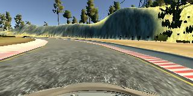
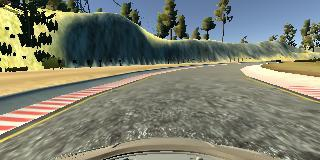

# Behavioral Cloning

### Overview

This project aims at cloning the driving behavior of user in the simulator. The captured data is then used to train a model which would drive the vehicle in autonomous mode in the same simulator, such that the vehicle completes at least one lap on the track for which the data was collected.

The steps of this project are the following:

* Use the simulator to collect data of good driving behavior
* Build, a convolution neural network in Keras that predicts steering angles from images
* Train and validate the model with a training and validation set
* Test that the model successfully drives around track one without leaving the road
* Summarize the results with a written report

## Files Submitted & Code Quality

__1. Submission includes all required files and can be used to run the simulator in autonomous mode__

My project includes the following files:

* model.py  : containing the script to create and train the model
* drive.py  : for driving the car in autonomous mode
* model.h5  : containing a trained convolution neural network
* writeup_report.md : summarizing the results
* video.mp4 : recording of the successful lap in autonomous mode

__2. Submission includes functional code__

Using the Udacity provided simulator and my drive.py file, the car can be driven autonomously around the track by executing

 `python drive.py model.h5`

 
__3. Submission code is usable and readable__

The model.py file contains the code for training and saving the convolution neural network. The file shows the pipeline I used for training and validating the model, and it contains comments to explain how the code works.

## Model Architecture

__1. An appropriate model architecture has been employed__

My model consists of 4 convolutions of filter sizes 7x7, 5x5 and 3x3 having depths between 16 and 64 (model.py lines 105-119).

The model includes ELU layers to introduce nonlinearity (model.py line 106), and the data is normalized in the model using a Keras lambda layer (model.py line 102).

Images are also converted to grayscale before normalization so that color does not interfere in the pattern which the model has to learn. 

__2. Attempts to reduce overfitting in the model__

The model contains two dropout layers with dropout probabilities of 0.3 and 0.2 after flatten and its' following dense layer respectively in order to reduce overfitting (model.py lines 124 - 129).

The model was trained and validated on different data sets created by the splitting the recorded dataset(model.py line 42). The model was tested by running it through the simulator and ensuring that the vehicle could stay on the track.

__3. Model parameter tuning__

The model used an adam optimizer, so the learning rate was not tuned manually (model.py line 135).

__4. Appropriate training data__

To collect data for the project, I took around 3 laps of the track. During these laps, car was almost at the center while moving near and away from the road boundaries at some points. The track has more of turns towards right rather than left. This would lead to the car turning more towards right even when not required sometimes.

To address these problem, I augmented the data by flipping the data horizontally. That would remove any direction bias from the dataset.

The data also has imaged from left and right camera. These images have to be interpreted as they were coming from the center camera. So I added correction of __0.3__ for these images in steering angle for these images.

## Training Strategy

__1. Solution Design Approach__

The overall strategy for deriving a model architecture was to make the car stay in the drivable portion of the road if not center of the road.

My first step was to use a convolution neural network model similar to LeNet-5. I thought this model might be appropriate because its' modified version did well in recognising the traffic signs.

In order to gauge how well the model was working, I split my image and steering angle data into a training and validation set. I found that my first model had a high mean squared error on both the training and validation sets. This implied that the model was not performing well for this application.

So, I modified the model by adding two more convolution layers and modifying the number of outputs in dense layers in the model. 
I also increased the filter size to 7x7 for the first convolutional layer. This model has only two dense layers, one of which is the output. I also converted the images to grayscale with more weight to red and green color channels and normalized them, bacause the only thing that the model has to learn was to stay in center of the lines where the road ends on both sides of the road.

The final step was to run the simulator to see how well the car was driving around track one. There were a few spots where the vehicle fell off the track initially but after modifications to the model, the driving behavior improved significantly.

At the end of the process, the vehicle is able to drive autonomously around the track without leaving the road.

__2. Final Model Architecture__

The final model architecture (model.py lines 96-131) consisted of a convolutional neural network with the following layers and layer sizes:

<table align="left" style="border:1px solid #cccccc">
    <thead>
        <tr style="border-bottom:1px solid #cccccc">
            <th style="text-align:center;border-right:1px solid #cccccc">Layer</th>
            <th style="text-align:center">Description</th>
        </tr>
    </thead>
    <tbody>
        <tr style="border-bottom:1px solid #cccccc">
            <td style="text-align:center;border-right:1px solid #cccccc">Input</td>
            <td style="text-align:center">BGR image of shape 160, 320, 3</td>
        </tr>
        <tr style="border-bottom:1px solid #cccccc">
            <td style="text-align:center;border-right:1px solid #cccccc">Cropping</td>
            <td style="text-align:center">50px from top and 20px from bottom</td>
        </tr>
        <tr style="border-bottom:1px solid #cccccc">
            <td style="text-align:center;border-right:1px solid #cccccc">Normalization</td>
            <td style="text-align:center">Normalize data to be in range of 0 to 1</td>
        </tr>
        <tr style="border-bottom:1px solid #cccccc">
            <td style="text-align:center;border-right:1px solid #cccccc">Convolution 7x7</td>
            <td style="text-align:center">1x1 stride, SAME padding, output 90x320x64</td>
        </tr>
        <tr style="border-bottom:1px solid #cccccc">
            <td style="text-align:center;border-right:1px solid #cccccc">ELU</td><td></td>
        </tr>
        <tr style="border-bottom:1px solid #cccccc">
            <td style="text-align:center;border-right:1px solid #cccccc">Max pooling</td>
            <td style="text-align:center">2x2 stride, SAME padding, output 45x160x64</td>
        </tr>
        <tr style="border-bottom:1px solid #cccccc">
            <td style="text-align:center;border-right:1px solid #cccccc">Convolution 5x5</td>
            <td style="text-align:center">1x1 stride, VALID padding, output 41x156x32</td>
        </tr>
        <tr style="border-bottom:1px solid #cccccc">
            <td style="text-align:center;border-right:1px solid #cccccc">ELU</td><td></td>
        </tr>
        <tr style="border-bottom:1px solid #cccccc">
            <td style="text-align:center;border-right:1px solid #cccccc">Max pooling</td>
            <td style="text-align:center">2x2 stride, SAME padding, output 19x78x32</td>
        </tr>
        <tr style="border-bottom:1px solid #cccccc">
            <td style="text-align:center;border-right:1px solid #cccccc">Convolution 3x3</td>
            <td style="text-align:center">1x1 stride, VALID padding, output 17x76x24</td>
        </tr>
        <tr style="border-bottom:1px solid #cccccc">
            <td style="text-align:center;border-right:1px solid #cccccc">ELU</td><td></td>
        </tr>
        <tr style="border-bottom:1px solid #cccccc">
            <td style="text-align:center;border-right:1px solid #cccccc">Max pooling</td>
            <td style="text-align:center">2x2 stride, SAME padding, output 9x38x24</td>
        </tr>
        <tr style="border-bottom:1px solid #cccccc">
            <td style="text-align:center;border-right:1px solid #cccccc">Convolution 3x3</td>
            <td style="text-align:center">1x1 stride, VALID padding, output 7x36x16</td>
        </tr>
        <tr style="border-bottom:1px solid #cccccc">
            <td style="text-align:center;border-right:1px solid #cccccc">ELU</td><td></td>
        </tr>
        <tr style="border-bottom:1px solid #cccccc">
            <td style="text-align:center;border-right:1px solid #cccccc">Max pooling</td>
            <td style="text-align:center">2x2 stride, SAME padding, output 4x18x16</td>
        </tr>
        <tr style="border-bottom:1px solid #cccccc">
            <td style="text-align:center;border-right:1px solid #cccccc">Flatten</td>
            <td style="text-align:center">output 1152</td>
        </tr>
        <tr style="border-bottom:1px solid #cccccc">
            <td style="text-align:center;border-right:1px solid #cccccc">Dropout</td>
            <td style="text-align:center">Keep probability 0.3</td>
        </tr>
        <tr style="border-bottom:1px solid #cccccc">
            <td style="text-align:center;border-right:1px solid #cccccc">Dense</td>
            <td style="text-align:center">output 516</td>
        </tr>
        <tr style="border-bottom:1px solid #cccccc">
            <td style="text-align:center;border-right:1px solid #cccccc">ELU</td><td></td>
        </tr>
        <tr style="border-bottom:1px solid #cccccc">
            <td style="text-align:center;border-right:1px solid #cccccc">Dropout</td>
            <td style="text-align:center">Keep probability 0.2</td>
        </tr>
        <tr style="border-bottom:1px solid #cccccc">
            <td style="text-align:center;border-right:1px solid #cccccc">Dense</td>
            <td style="text-align:center">output 1, which is the steering angle prediction</td>
        </tr>
    </tbody>
</table>

__3. Creation of the Training Set & Training Process__

For the first track, I recorded the run for three laps to get sufficient data for training and validation.

To augment the data sat, I also flipped images and angles so that there is equal data for vehicle turning on both sides. 
For example, here is an image that has then been flipped:
<table>
    <tr>
        <td style="text-align:center">
          
           Fig1: Original image
        </td>
        <td style="text-align:center">
          
           Fig2: Flipped image
        </td>
    </tr>
</table>
I also used the images from left and right camera so that they were coming from center camera by adding a steer correction of 0.3 accordingly.

After the collection process, I had 11176 number of data points for training and 2795 for validation. I then preprocessed this data by converting the images to grayscale so that only the pattern is captured. I also normaized the image so that values fall in range of 0 and 1.

I finally randomly shuffled the data set and put 20% of the data into a validation set.

I used this training data for training the model. The validation set helped determine if the model was over or under fitting. The ideal number of epochs was 7, since the loss was decreasing till 7 epochs and tend to increase thereafter. I used an adam optimizer so that manually setting the learning rate wasn't necessary.

Following is the link for recorded output video for this project:
https://github.com/rahul1593/Behavioral-Cloning-Project/raw/master/video.mp4

